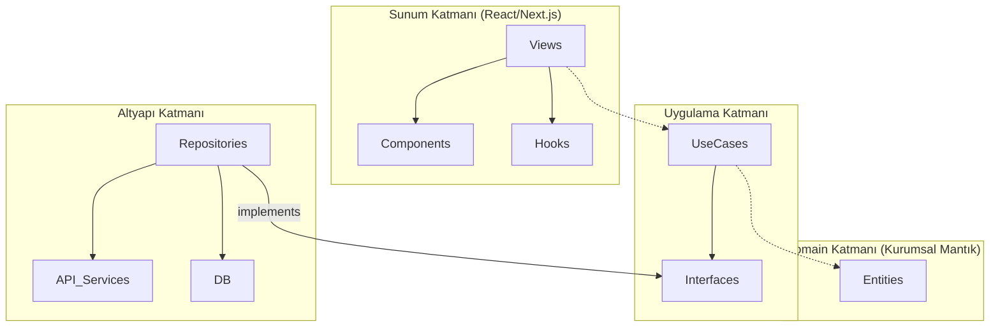

# ARCH-CV 🏗️
### Mühendislik Kariyer Mimarisi Platformu

[](https://nextjs.org/)
[](https://www.typescriptlang.org/)
[](https://zustand-demo.pmnd.rs/)
[](https://blog.cleancoder.com/uncle-bob/2012/08/13/the-clean-architecture.html)

**ARCH-CV**, yazılım mühendisleri için özel olarak tasarlanmış üst düzey bir kariyer mimarisi aracıdır. Dijital ayak izinizi analiz ederek ve mühendislik felsefenizi yansıtan profesyonel bir manifesto oluşturmanıza yardımcı olarak basit bir özgeçmiş oluşturucunun ötesine geçer.

---

## ✨ Temel Özellikler

- **🛡️ Clean Architecture**: Teknik borcu sıfıra indirmek ve yüksek test edilebilirlik sağlamak için katı bir sorumluluk ayrımı (Domain, Application, Infrastructure, Presentation) ile inşa edilmiştir.
- **🔗 GitHub Zekası**: Veri odaklı bir profil oluşturmak için en iyi projelerinizi, dillerinizi ve katkılarınızı otomatik olarak senkronize eder.
- **🧠 Mühendislik Manifestosu**: Mühendislik prensiplerinizi ve sorun çözme yaklaşımınızı ifade etmenize yardımcı olmak için AI kullanır.
- **💎 Premium UI/UX**: En modern kullanıcı deneyimi için Tailwind CSS ve Framer Motion ile oluşturulmuş şık, koyu temalı bir arayüz.
- **⚡ Gerçek Zamanlı Önizleme**: Kimliğinizi ve deneyimlerinizi yapılandırırken "Kariyer Blueprint"inizin anında şekillenmesini izleyin.

---

## 🛠️ Teknoloji Yığını

- **Framework**: [Next.js 15+](https://nextjs.org/) (App Router)
- **State Management**: [Zustand](https://github.com/pmndrs/zustand)
- **Styling**: [Tailwind CSS 4](https://tailwindcss.com/)
- **UI Components**: [Radix UI](https://www.radix-ui.com/) & [Shadcn UI](https://ui.shadcn.com/)
- **Icons**: [Lucide React](https://lucide.dev/)
- **AI Integration**: [Google Gemini Pro API](https://ai.google.dev/)

---

## 🏗️ Mimari Genel Bakış

Proje, **Uncle Bob'un Clean Architecture** desenini takip eder:



---

## 🚀 Başlarken

### Gereksinimler

- Node.js 18.x veya üzeri
- npm / pnpm / yarn
- Bir GitHub Kişisel Erişim Token'ı (genişletilmiş API sınırları için)
- Google Gemini API Anahtarı (Manifesto oluşturucu için)

### Kurulum

1. **Depoyu kopyalayın**:
   ```bash
   git clone https://github.com/OmNexuss/Arch-CV.git
   cd Arch-CV
   ```

2. **Bağımlılıkları yükleyin**:
   ```bash
   npm install
   ```

3. **Ortam değişkenlerini ayarlayın**:
   Kök dizinde bir `.env.local` dosyası oluşturun (örnek olarak `.env.example` dosyasını kullanabilirsiniz):
   ```env
   GEMINI_API_KEY=your_gemini_api_key
   ```

4. **Geliştirme sunucusunu çalıştırın**:
   ```bash
   npm run dev
   ```

---

## 🤝 Katkıda Bulunma

Katkılarınız bekliyoruz! ARCH-CV'yi geliştirmek isterseniz lütfen şu adımları izleyin:
1. Projeyi fork edin.
2. Özellik Dalınızı (Feature Branch) oluşturun (`git checkout -b feature/AmazingFeature`).
3. Değişikliklerinizi commitleyin (`git commit -m 'Add some AmazingFeature'`).
4. Dalı pushlayın (`git push origin feature/AmazingFeature`).
5. Bir Pull Request açın.

---

## ⚖️ Lisans

MIT Lisansı ile dağıtılmaktadır. Daha fazla bilgi için `LICENSE` dosyasına bakın.

---

**© 2026 OmNexus. Tüm Hakları Saklıdır.**
