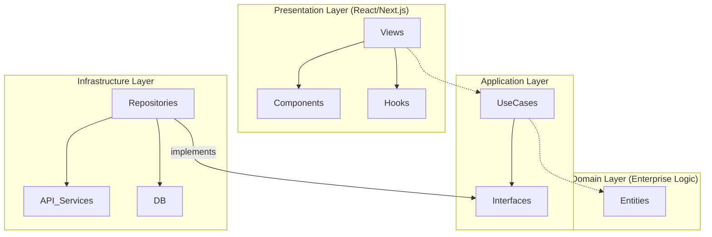

# ARCH-CV 🏗️
### Engineering Career Architecture Platform

[](https://nextjs.org/)
[](https://www.typescriptlang.org/)
[](https://zustand-demo.pmnd.rs/)
[](https://blog.cleancoder.com/uncle-bob/2012/08/13/the-clean-architecture.html)

**ARCH-CV** is a high-end career architecture tool designed specifically for software engineers. It goes beyond simple resume building by analyzing your digital footprint and helping you construct a professional manifesto that reflects your engineering philosophy.

---

## ✨ Key Features

- **🛡️ Clean Architecture**: Built with a strict separation of concerns (Domain, Application, Infrastructure, Presentation) to ensure zero technical debt and high testability.
- **🔗 GitHub Intelligence**: Automatically synchronizes your top projects, languages, and contributions to build a data-driven profile.
- **🧠 Engineering Manifesto**: Uses AI to help you articulate your engineering principles and problem-solving approach.
- **💎 Premium UI/UX**: A sleek, dark-themed interface built with Tailwind CSS and Framer Motion for a state-of-the-art user experience.
- **⚡ Real-time Preview**: See your "Career Blueprint" take shape instantly as you configure your identity and experiences.

---

## 🛠️ Tech Stack

- **Framework**: [Next.js 15+](https://nextjs.org/) (App Router)
- **State Management**: [Zustand](https://github.com/pmndrs/zustand)
- **Styling**: [Tailwind CSS 4](https://tailwindcss.com/)
- **UI Components**: [Radix UI](https://www.radix-ui.com/) & [Shadcn UI](https://ui.shadcn.com/)
- **Icons**: [Lucide React](https://lucide.dev/)
- **AI Integration**: [Google Gemini Pro API](https://ai.google.dev/)

---

## 🏗️ Architecture Overview

The project follows the **Uncle Bob's Clean Architecture** pattern:



---

## 🚀 Getting Started

### Prerequisites

- Node.js 18.x or higher
- npm / pnpm / yarn
- A GitHub Personal Access Token (for extended API limits)
- Google Gemini API Key (for the Manifesto generator)

### Installation

1. **Clone the repository**:
   ```bash
   git clone https://github.com/OmNexuss/Arch-CV.git
   cd Arch-CV
   ```

2. **Install dependencies**:
   ```bash
   npm install
   ```

3. **Set up environment variables**:
   Create a `.env.local` file in the root directory (you can use `.env.example` as a template):
   ```env
   GEMINI_API_KEY=your_gemini_api_key
   ```

4. **Run the development server**:
   ```bash
   npm run dev
   ```

---

## 🤝 Contributing

Contributions are welcome! If you'd like to improve ARCH-CV, please follow these steps:
1. Fork the project.
2. Create your Feature Branch (`git checkout -b feature/AmazingFeature`).
3. Commit your changes (`git commit -m 'Add some AmazingFeature'`).
4. Push to the Branch (`git push origin feature/AmazingFeature`).
5. Open a Pull Request.

---

## ⚖️ License

Distributed under the MIT License. See `LICENSE` for more information.

---

<p align="center">
  <b>Built with precision by OmNexus</b><br/>
  <i>"Architecting the future of engineering careers."</i>
</p>
